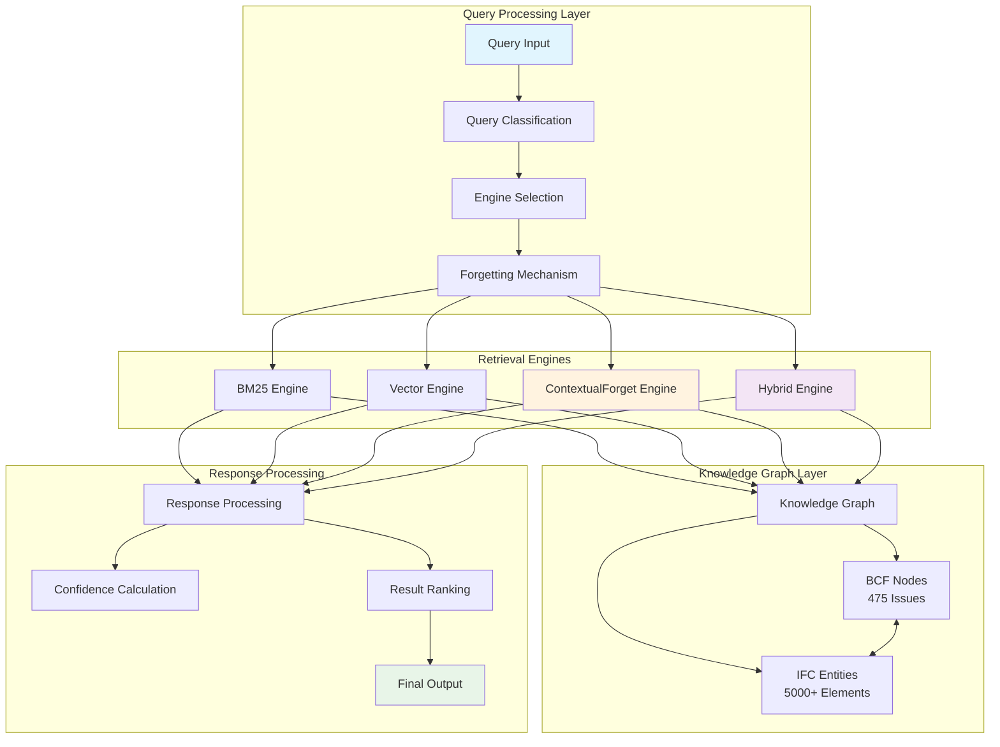
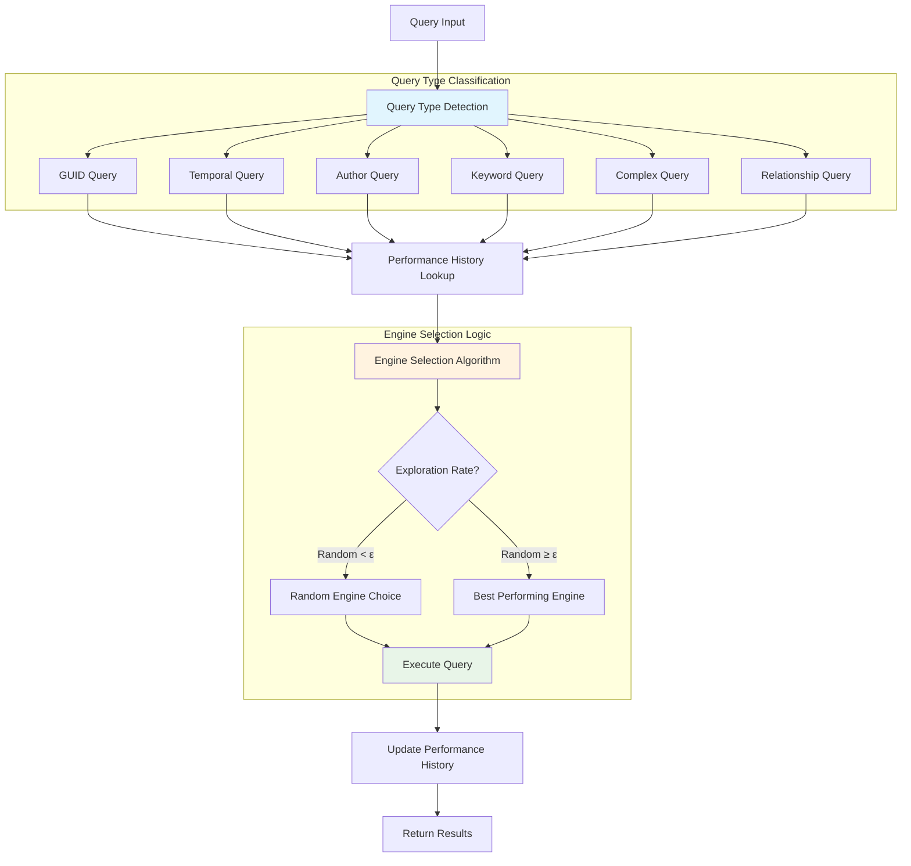
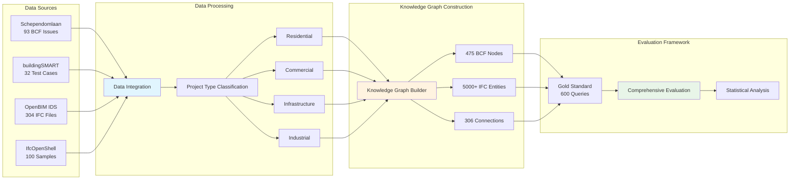
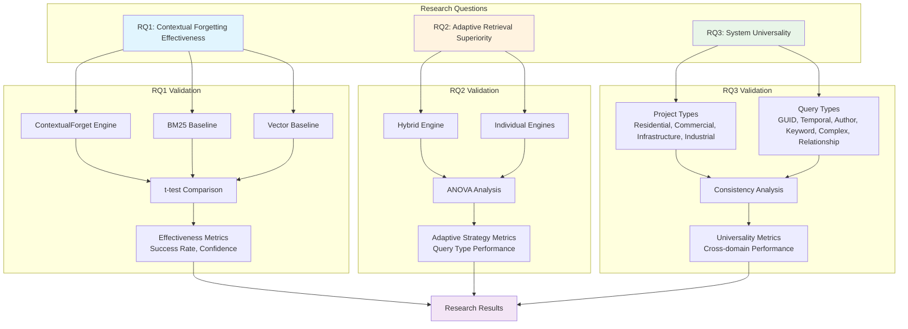

# ContextualForget 시스템 아키텍처 다이어그램

## 1. 전체 시스템 아키텍처



## 2. 망각 메커니즘 흐름도

```mermaid
flowchart TD
    Q[Query Input] --> CH[Context History Update]
    CH --> FSC[Forgetting Score Calculation]
    
    subgraph "Score Components"
        FSC --> US[Usage Score<br/>w_u × min(access_count/10, 1.0)]
        FSC --> RS[Recency Score<br/>w_r × exp(-λ × Δt/365)]
        FSC --> VS[Relevance Score<br/>w_v × cosine_similarity]
    end
    
    US --> FS[Final Forgetting Score<br/>S_f = w_u×S_u + w_r×S_r + w_v×S_v]
    RS --> FS
    VS --> FS
    
    FS --> TH{Score > Threshold?}
    TH -->|Yes| AR[Adaptive Ranking]
    TH -->|No| FILTER[Filter Low Score Documents]
    
    FILTER --> AR
    AR --> RANK[Ranked Results]
    RANK --> OUT[Final Output]
    
    style FS fill:#ffebee
    style TH fill:#e3f2fd
    style AR fill:#e8f5e8
```

## 3. 적응적 검색 전략 플로우



## 4. 데이터 흐름 다이어그램



## 5. 성능 메트릭 및 평가 체계

```mermaid
graph TB
    subgraph "Performance Metrics"
        SR[Success Rate]
        CONF[Confidence Score]
        RT[Response Time]
        MEM[Memory Usage]
        CPU[CPU Usage]
    end
    
    subgraph "Evaluation Types"
        SR --> ENG[Engine-wise Evaluation]
        CONF --> QTYPE[Query Type Evaluation]
        RT --> PROJ[Project Type Evaluation]
        MEM --> SCALE[Scalability Evaluation]
        CPU --> STAT[Statistical Validation]
    end
    
    subgraph "Statistical Tests"
        ENG --> TTEST[t-test<br/>ContextualForget vs Others]
        QTYPE --> ANOVA[ANOVA<br/>Query Type Effects]
        PROJ --> COHEN[Cohen's d<br/>Effect Size]
        SCALE --> COMPLEX[Complexity Analysis<br/>O(log n) ~ O(n)]
        STAT --> SIG[Significance Testing<br/>p < 0.01]
    end
    
    subgraph "Visualization Outputs"
        TTEST --> HIST[Histograms]
        ANOVA --> BOX[Box-Whisker Plots]
        COHEN --> HEAT[Heatmaps]
        COMPLEX --> LINE[Line Charts]
        SIG --> SCATTER[Scatter Plots]
    end
    
    style TTEST fill:#ffebee
    style ANOVA fill:#e3f2fd
    style COHEN fill:#e8f5e8
    style COMPLEX fill:#fff3e0
    style SIG fill:#f3e5f5
```

## 6. 연구 질문(RQ) 검증 체계



---

## 다이어그램 설명

### 1. 전체 시스템 아키텍처
- **Query Processing Layer**: 쿼리 분류, 엔진 선택, 망각 메커니즘
- **Retrieval Engines**: 4개 엔진 (BM25, Vector, ContextualForget, Hybrid)
- **Knowledge Graph Layer**: BCF 노드와 IFC 엔티티의 통합 그래프
- **Response Processing**: 신뢰도 계산 및 결과 순위화

### 2. 망각 메커니즘 흐름도
- **3가지 점수 구성요소**: Usage, Recency, Relevance
- **가중치 기반 결합**: w_u=0.3, w_r=0.4, w_v=0.3
- **임계값 기반 필터링**: 낮은 점수 문서 제거
- **적응적 순위화**: 최종 결과 순위 결정

### 3. 적응적 검색 전략 플로우
- **6가지 쿼리 타입**: GUID, Temporal, Author, Keyword, Complex, Relationship
- **성능 이력 기반 선택**: 과거 성능 데이터 활용
- **탐색 vs 활용**: ε-greedy 전략
- **동적 업데이트**: 성능 이력 실시간 갱신

### 4. 데이터 흐름 다이어그램
- **4가지 데이터 소스**: Schependomlaan, buildingSMART, OpenBIM, IfcOpenShell
- **프로젝트 타입 분류**: 주거, 상업, 인프라, 산업
- **통합 지식 그래프**: 475 BCF 노드 + 5000+ IFC 엔티티
- **종합 평가 프레임워크**: 600개 질의 기반 평가

### 5. 성능 메트릭 및 평가 체계
- **5가지 핵심 메트릭**: 성공률, 신뢰도, 응답시간, 메모리, CPU
- **다차원 평가**: 엔진별, 쿼리타입별, 프로젝트타입별
- **통계적 검증**: t-test, ANOVA, Cohen's d, 복잡도 분석
- **시각화 출력**: 히스토그램, 박스플롯, 히트맵, 선형차트, 산점도

### 6. 연구 질문(RQ) 검증 체계
- **RQ1**: ContextualForget vs 기존 엔진들의 효과성 비교
- **RQ2**: 적응적 검색 전략의 우수성 검증
- **RQ3**: 다양한 도메인과 쿼리 타입에서의 범용성 입증
- **통합 결과**: 3개 RQ의 종합적 검증 결과
